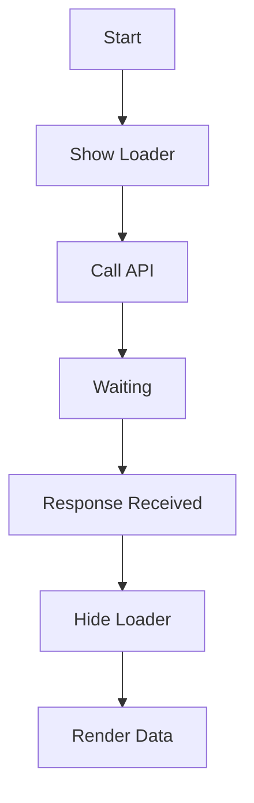

<div align="center">

# 🌐 API Call Loading and Showing Loader while Loading Data


### ⏳ Loading Animation While Waiting for Server Response


</div>

---

# 🚀 Overview

This project demonstrates how to:

✅ Fetch data from an API

✅ Display a professional loading screen

✅ Handle asynchronous requests

✅ Improve user experience during data fetching

✅ Display API response dynamically

✅ Handle loading and error states

---

# 🎥 Project Preview

<div align="center">


</div>

---

# ⚡ Workflow

```text
User Request
     │
     ▼
Show Loader
     │
     ▼
API Request Sent
     │
     ▼
Waiting For Server
     │
     ▼
Response Received
     │
     ▼
Hide Loader
     │
     ▼
Display Data
```

---

# 🛠️ Technologies Used

| Technology | Purpose |
|------------|----------|
| ReactJS | Frontend |
| JavaScript | Logic |
| Fetch API / Axios | API Calls |
| CSS3 | Styling |
| HTML5 | Structure |

---

# 📂 Project Structure

```bash
src/
│
├── components/
│   ├── Loader.jsx
│   ├── ApiData.jsx
│
├── App.jsx
├── main.jsx
└── styles.css
```

---

# 🔄 Loading State Example

```javascript
const [loading, setLoading] = useState(true);

useEffect(() => {
  fetch(API_URL)
    .then((res) => res.json())
    .then((data) => {
      setData(data);
      setLoading(false);
    });
}, []);
```

---

# 🎨 Features

✨ Modern Loader Animation

✨ API Integration

✨ Responsive Design

✨ Error Handling

✨ Clean UI

✨ Reusable Components

✨ Fast Performance

---

# 📊 Status Flow



---

# 📸 Screenshots

## Loading State


---

## Data Loaded Successfully


---

# 🚀 Installation

### Clone Repository

```bash
git clone https://github.com/GurmanSingh7/API-Call-Loading-Demo.git
```

### Install Dependencies

```bash
npm install
```

### Run Project

```bash
npm run dev
```

---

# 💡 Use Cases

- Dashboard Loading States
- User Authentication Screens
- Product Fetching
- Weather APIs
- News APIs
- Admin Panels
- Analytics Platforms

---

# 👨‍💻 Developer

### Gurman Singh

GitHub:

https://github.com/GurmanSingh7

---

<div align="center">

## ⭐ Star This Repository If You Found It Useful


### Happy Coding 🚀

</div>
